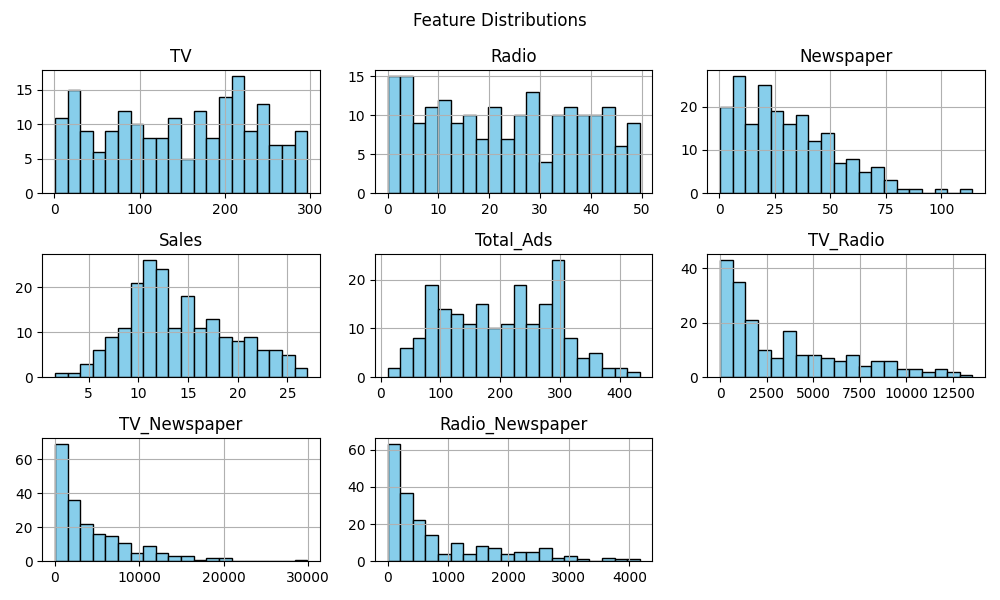
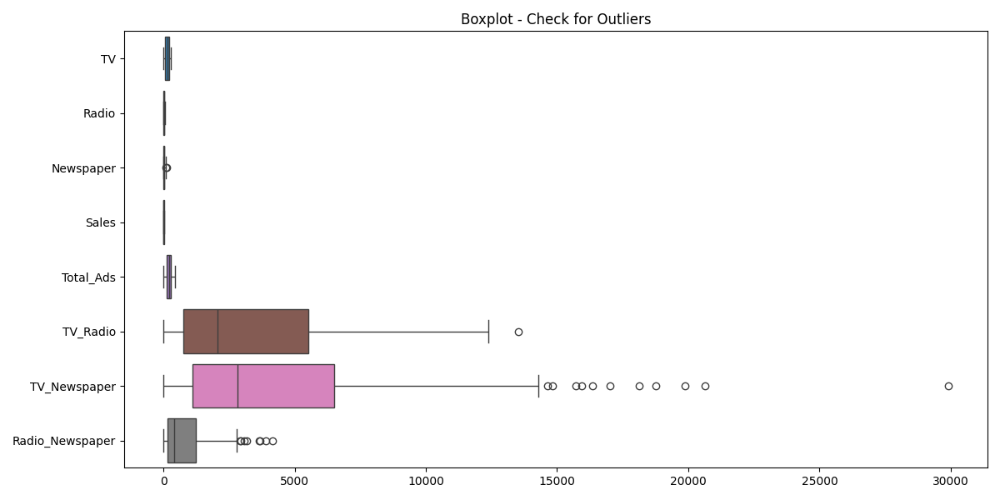
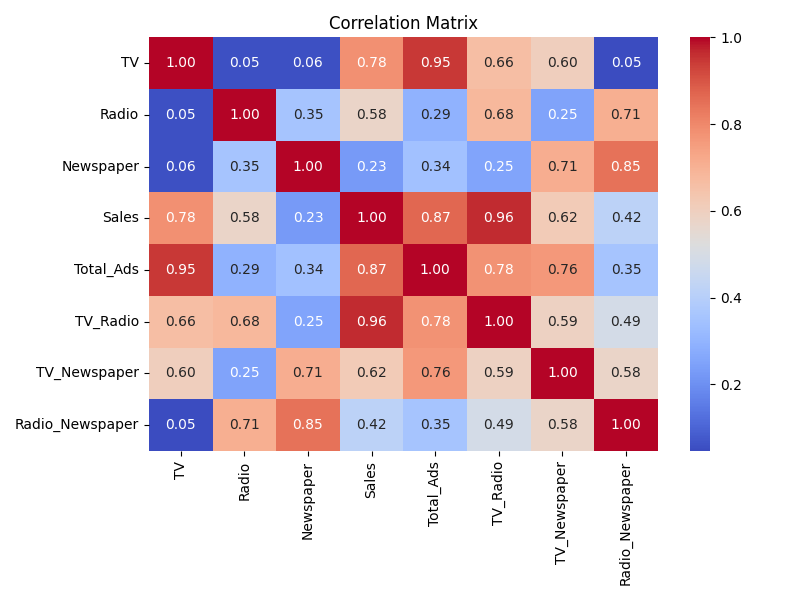
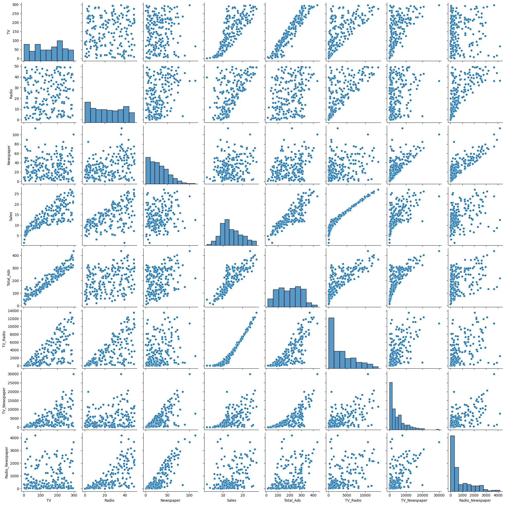

# Advertising Sales Prediction Project

This project predicts **sales of a product based on advertising spends** on TV, Radio, and Newspaper. The goal is to provide actionable insights to marketing teams, optimize ad budgets, and demonstrate end-to-end **Data Science & Machine Learning workflow**.

---

## Table of Contents

1. [Project Overview](#project-overview)  
2. [Project Workflow](#project-workflow)  
3. [Project Structure](#project-structure)  
4. [Dataset](#dataset)  
5. [Features & Engineering](#features--engineering)  
6. [Exploratory Data Analysis (EDA)](#exploratory-data-analysis-eda)  
7. [Modeling](#modeling)  
8. [Deployment](#deployment)  
9. [How to Run](#how-to-run)  
10. [Example Results](#example-results)  
11. [Technologies & Libraries](#technologies--libraries)  
12. [Future Enhancements](#future-enhancements)  
13. [License](#license)  
14. [Author](#author)  

---

## Project Overview

This project predicts product sales based on advertising spend across different channels such as **TV**, **Radio**, and **Newspaper**. Using historical data, it forecasts sales and helps optimize marketing budgets.

**Key Highlights**:
- Multiple regression models for comparison  
- Feature scaling and engineering  
- EDA with outlier detection and visualizations  
- Streamlit-based interactive UI for real-time predictions  
- End-to-end Data Science workflow: Data Loading → Preprocessing → Feature Engineering → Modeling → Deployment  

---

## Project Workflow

The project follows a structured **end-to-end ML pipeline**:

1. **Data Collection** → Import dataset (`advertising.csv`)  
2. **Data Preprocessing** → Handle nulls, duplicates, clean data  
3. **EDA** → Understand distributions, correlations, and detect outliers  
4. **Feature Engineering** → Create interaction features (e.g., TV × Radio)  
5. **Model Training** → Train & evaluate Linear Regression, Random Forest, Gradient Boosting  
6. **Model Selection** → Pick best-performing model based on RMSE, R²  
7. **Deployment** → Deploy Gradient Boosting model via **Streamlit app**  
8. **User Interaction** → Business users input ad spend → Predict sales in real-time  

---

## Project Structure

sales_prediction/
│
├── data/
│ ├── advertising.csv # Original dataset
│ └── processed_Advertising.csv # Cleaned & processed dataset
│
├── notebooks/
│ └── advertising_analysis.ipynb # EDA, feature engineering, model comparison
│
├── reports/
│ └── figures/ # EDA plots, correlation matrices, boxplots, pairplots
│ ├── histograms.png
│ ├── boxplots.png
│ ├── correlation_matrix.png
│ └── pairplot.png
|
├── src/
│ ├── __init__.py
│ ├── data_processing.py # Data loading & preprocessing
│ ├── feature_engineering.py # Feature engineering
│ ├── model.py # Model training & comparison
│ └── deploy.py # Deployment utilities (load model, predict)
│
├── logs/ # Logs of project runs
│ └── project_YYYYMMDD_HHMMSS.log
│
├── models/
│ └── best_model.pkl # Saved trained model & scaler
│
├── app.py # Streamlit app for real-time prediction
├── requirements.txt # All required Python packages
└── README.md # Project overview & instructions


---

## Dataset
The dataset consists of advertising spend in thousands of dollars for 200 campaigns:

| Feature       | Description                                      |
|---------------|--------------------------------------------------|
| TV            | Advertising spend on TV                          |
| Radio         | Advertising spend on Radio                       |
| Newspaper     | Advertising spend on Newspaper                  |
| Sales         | Product sales (target variable)                  |

---

## Features & Engineering
New features were added to enhance model performance:

- `Total_Ads` = TV + Radio + Newspaper  
- `TV_Radio` = TV * Radio  
- `TV_Newspaper` = TV * Newspaper  
- `Radio_Newspaper` = Radio * Newspaper  

These features capture **interaction effects** between advertising channels.

---

## Exploratory Data Analysis (EDA)
- Distribution plots, histograms, and boxplots for all features  
- Correlation heatmaps and pairplots  
- Outlier detection using **IQR method** 

**Outlier Summary:**

| Column           | Outlier Indices                |
|-----------------|-------------------------------|
| TV              | []                             |
| Radio           | []                             |
| Newspaper       | [16, 101]                     |
| Sales           | []                             |
| Total_Ads       | []                             |
| TV_Radio        | [175]                          |
| TV_Newspaper    | [0, 17, 93, 98, 101, 124, 137, 141, 165, 183, 198] |
| Radio_Newspaper | [2, 5, 16, 55, 75, 101, 118, 183] |

**Visualizations:**  
Saved in `reports/figures/` and displayed in notebooks:

- Histogram:   
- Boxplot:   
- Correlation Matrix:   
- Pairplot:   

---

## Modeling
Three regression models were trained and compared:

| Model                  | RMSE  | R²     |
|------------------------|-------|--------|
| Linear Regression      | 0.887 | 0.975  |
| Random Forest          | 0.616 | 0.988  |
| Gradient Boosting      | 0.599 | 0.989  |

**Best model:** Gradient Boosting Regressor  
Saved with scaler for deployment: `models/best_model.pkl`

---

## Deployment
The project includes a **Streamlit app** (`app.py`) to make real-time predictions.  
Features:

- User-friendly **input fields** for advertising spend  
- Automatic calculation of interaction features  
- Automatic calculation of engineered features  
- Real-time prediction of sales  
- Display of both **predicted sales** and **entered input data**  

**Sample Input:**

| Feature         | Value  |
|----------------|--------|
| TV             | 100    |
| Radio          | 30     |
| Newspaper      | 20     |

**Output:**

- Predicted Sales: 13.77  
---

## How to Run
1. Clone the repository:
```bash
   git clone <repository-url>
   cd sales_prediction
   ```
2. Install dependencies:
```bash
   pip install -r requirements.txt
   ```
3. Run Streamlit app:
```bash
   streamlit run app.py
   ```
4. Open the displayed link in your browser and enter input values to predict sales.

---

## Results

### Example prediction:

Input:
      {
        "TV": 100,
        "Radio": 30,
        "Newspaper": 20
      }

Output:
       Predicted Sales: 13.77

---

## Technologies & Libraries

- Python 3.12
- pandas, numpy, matplotlib, seaborn
- scikit-learn (Linear Regression, Random Forest, Gradient Boosting)
- joblib (model persistence)
- Streamlit (web app)

---

## Future Enhancements

- Include additional advertising channels (e.g., Social Media, Online Ads)
- Integrate real-time campaign data for dynamic prediction
- Develop a REST API for integration with web/mobile applications
- Add interactive dashboards for comprehensive marketing insights
- Hyperparameter tuning for improved model performance
- Implement cross-validation and ensemble stacking for more robust predictions

---

## License

This project is licensed under the MIT License.
See the LICENSE
 file for details.

---

## Author

Ayesha Banu

M.Sc. Computer Science |  Gold Medalist

Data Scientist | Data Analyst | Full-Stack Python Developer | GenAI Enthusiast

Email: ayesha24banu@gmail.com

Linkedin: https://www.linkedin.com/in/ayesha_banu_cs